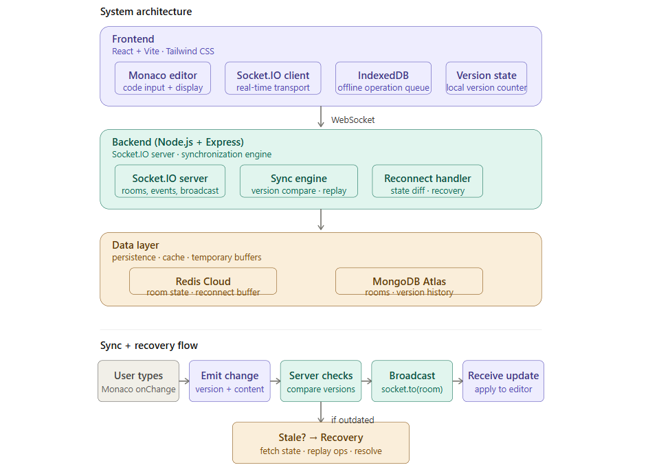

# Resilient Real-Time Collaborative Coding Platform

> An engineering exploration of synchronization reliability and collaborative system resilience under unstable network conditions.

---

## Project Structure

```
collab-code/
├── client/          # React + Vite + Monaco + Socket.IO client
├── server/          # Node.js + Express + Socket.IO + Redis + MongoDB
└── README.md
```

---

## Prerequisites

| Tool    | Version | Install                                           |
| ------- | ------- | ------------------------------------------------- |
| Node.js | 18+     | https://nodejs.org                                |
| npm     | 9+      | bundled with Node                                 |
| Redis   | 7+      | https://redis.io/download OR Redis Cloud          |
| MongoDB | 6+      | https://mongodb.com/try/download OR MongoDB Atlas |

---

## Quick Start (Local Dev)

### 1. Clone / unzip the project

```bash
cd collab-code
```

### 2. Start the backend

```bash
cd server
cp .env.example .env          # edit with your Redis + Mongo URLs
npm install
npm run dev
# → Server running on http://localhost:5000
```

### 3. Start the frontend

```bash
cd ../client
npm install
npm run dev
# → App running on http://localhost:5173
```

### 4. Open two browser tabs

- http://localhost:5173
- Enter the same Room ID in both — start typing and watch it sync live.

---

## Environment Variables

### server/.env

```env
PORT=5000
MONGO_URI=mongodb://localhost:27017/collabcode
REDIS_URL=redis://localhost:6379
CLIENT_URL=http://localhost:5173
```

For cloud services:

- **MongoDB Atlas**: replace MONGO_URI with your Atlas connection string
- **Redis Cloud**: replace REDIS_URL with `redis://:<password>@<host>:<port>`

---

## Deployment

### Frontend → Vercel

```bash
cd client
npm run build
# Push to GitHub, connect repo to Vercel
# Set VITE_SERVER_URL env var to your backend URL
```

### Backend → Render / Railway

- Connect GitHub repo
- Set root dir to `server/`
- Add all `.env` vars in the dashboard
- Start command: `npm start`

---

## Engineering Highlights (Interview Talking Points)

1. **Version tracking** — every edit carries a monotonic version number; stale updates are detected and trigger recovery
2. **Offline operation queue** — IndexedDB buffers edits while disconnected; replays them in order on reconnect
3. **Reconnect recovery** — client fetches latest server state, diffs versions, replays only missing ops
4. **Redis reconnect buffer** — server keeps a per-room op buffer for short disconnects (no DB hit needed)
5. **Conflict awareness** — last-writer-wins with version guard; extensible to OT/CRDT (Yjs drop-in ready)

# Screenshots

## Real-Time Collaboration


## Architecture Overview


